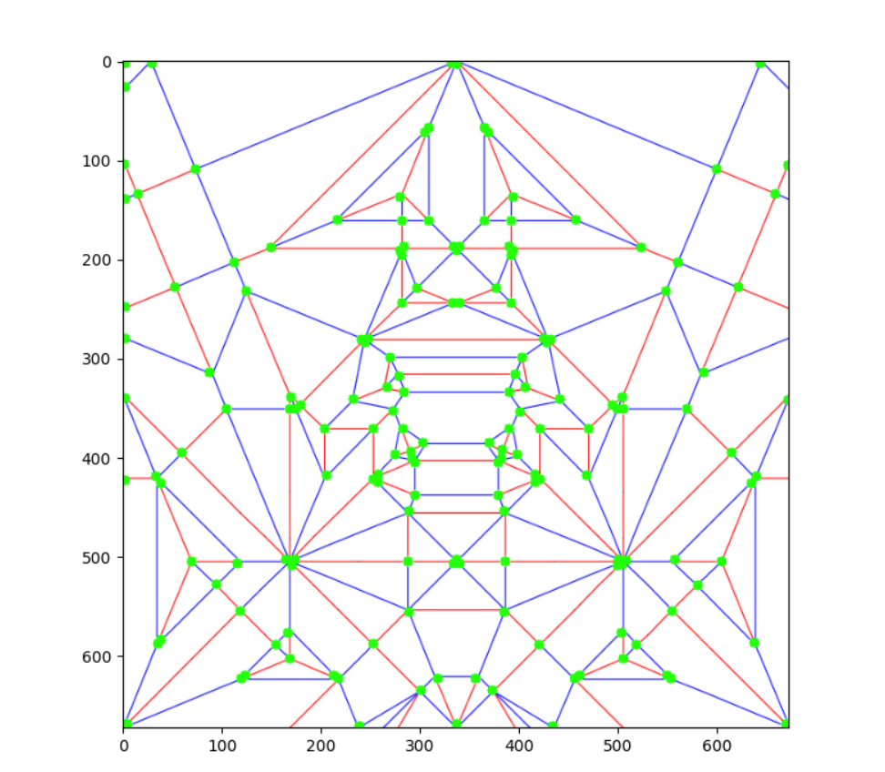

import Latex from '../../components/Latex.astro'
import InlineLatex from '../../components/InlineLatex.astro'

Identifying starting reference folds from a [crease pattern](https://en.wikipedia.org/wiki/Crease_pattern) is one of 
the most crucial skills for figurative origami folders. It is also one of the most difficult tasks for beginner folders
to grasp, especially when moving from origami designs based on angles of 45&deg; to 22.5&deg;. Once starting reference
folds are located, folders can perform a [level-order traversal](https://en.wikipedia.org/wiki/Breadth-first_search) 
of folds to pre-crease the model. My goal was to automate the process of locating starting reference folds from a 
[raster](https://en.wikipedia.org/wiki/Raster_graphics) crease pattern image. The code for a web-app demo of this
algorithm can be found on [Github](https://github.com/hunger-cp/img2cp). A Jupyter notebook demo of this algorithm can be found on [Google Colab](https://colab.research.google.com/drive/1zbKQMQm-CBQU1WjXgZEqbIYEnOUe-WI-?usp=sharing).

# Corner Detection
The first task was to identify vertices and lines in the crease pattern image. I tested a variety of corner and 
edge detection algorithms. Most corner and edge detection algorithms had unsuitable results. 
The most accurate algorithms in regard to crease patterns were the [Hough Line Transform](https://en.wikipedia.org/wiki/Hough_transform)
and the [Shi-Tomasi](https://users.cs.duke.edu/~tomasi/papers/shi/TR_93-1399_Cornell.pdf) corner detection algorithm. 
Hough Line Transform was ultimately unsuited for crease pattern line detection as lines in crease patterns scale 
to very small ratios in comparison to the lines used to model paper edges. The Hough Line Transform ranks 
possible line candidates by votes that exceed a threshold. Due to the scalability
of crease pattern lines, there is no sufficient threshold that exists. 

Shi-Tomasi on a crease pattern

One significant issue with Shi-Tomasi however, was the detection of multiple corners on  the same vertex. 
For this reason, along with the scalability error of crease pattern images, I chose not to use a mathematically pure
approach to this problem. 

# Reverse Kamiya Reference Finder
The second task was to find two reference lines that intersect at any given point in the crease pattern.
Satoshi Kamiya has a nice 22.5&deg; based reference finder on his [website](https://folders.jp/reference/reference). He
wrote about the mathematical process in [Tanteidan Magazine 115](https://www.giladorigami.com/BO_Tanteidan_Magazine_115.html). 
The reference finder takes a length in the form of <InlineLatex formula='a+b\sqrt{2}' /> and calculates reference folds
that divide paper into a ratio that involves the length. It then renders the folding sequence by combining images of
reference lines, such that the intersection of the reference lines aligns with the ratio. When I began to work on the project
I thought of taking ratios of the points and deriving a ratio in the form of <InlineLatex formula='a+b\sqrt{2}' /> so that
the user could plug it into Kamiya's Reference Finder. As mentioned earlier however, the scaling error proved far to great
to accurately derive a ratio.

This forced me to work backwards, reversing Kamiya's Reference Finder process. I exported the reference folds from Kamiya's
site and used the Hough Line Transform to vectorize the raster images of reference folds, as there was only one necessary
line to identify. The vectorized values were stored in a file so they do not have to be recomputed. All possible reference
folds for 22.5&deg; models have now been stored. Next, the algorithm would need to locate a point in the crease pattern
that shares the same ratio as the intersection of any two reference folds. I chose a brute-force approach by calculating
all 3,000 intersections between any 2 Kamiya reference folds. The algorithm then scales the intersection coordinates
from a [0, 1] plane to a plane the size of the image and compares it with all detected vertices, picking the one with least
error.

# Optimization
I shared my results online in the [Origami-Dan Discord](https://disboard.org/server/553401275127955476). [Jason Ku](http://jasonku.mit.edu/)
was kind enough to give me some tips on optimization. He advised to pre-compute the 3,000 intersections and store the coordinates
in a data-structure reducing time complexity that came with recalculating the intersections.

# Other Applications
Finding a starting reference point also gives a perfect vertex for algorithmically solving a crease pattern. When the starting vertex
is identified, a level-order traversal can be run to locate all other vertices and remove error from the edge detection.

Another application is diagram generation for precreasing. If the folds for the starting reference point can be found, they can be
drawn into instructional diagrams. If the above algorithm was realized, folds could be calculated for all other vertices and consequently
be drawn into instructional diagram steps as well, automating the tedious process of diagram drawing.